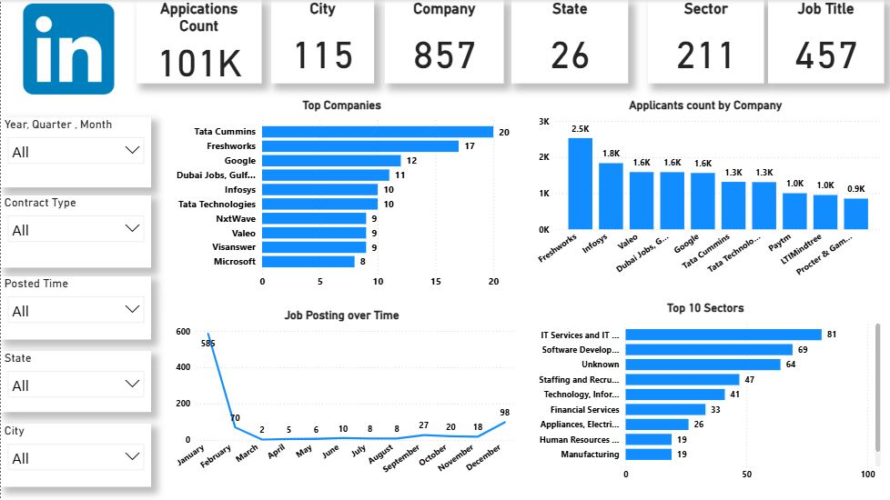

# 💼 LinkedIn Jobs Market Analysis — Power BI

## 📌 Project Overview

A Power BI dashboard analyzing job-market trends across companies, cities, states, sectors, job titles, applications, and posting timelines using LinkedIn job data from India.

## 🛠️ Tools

- Power BI
- Excel / CSV
- Data Cleaning
- Data Visualization

## 📊 Key KPIs

| KPI | Value |
|---|---:|
| Job Postings | 857 |
| Applications | 101K |
| Cities | 115 |
| States | 26 |
| Job Titles | 466 |

## 🔍 Key Insights

- **Bengaluru** had the highest number of job postings with **178**, followed by Mumbai with **110**.
- **Karnataka** led state-level job postings with **224**, followed by Maharashtra with **193**.
- **IT Services & IT Consulting** was the largest sector with **81 postings**.
- **Data Scientist** was the most frequently posted job title with **40 postings**.
- **Freshworks** received the highest total applications at approximately **2.5K**.

## 📈 Power BI Dashboard

## 💡 Business Recommendations

- Focus job searches on high-demand markets such as **Bengaluru and Mumbai**.
- Prioritize high-demand roles such as **Data Scientist, Product Manager, and Financial Analyst**.
- Use sector-level trends to identify industries with stronger hiring activity.

## 📁 Files

- `LinkedIn_Jobs_Data.csv` — Source dataset
- `LinkedIN Analysis.pbix` — Power BI project
- `LinkedIN_Analysis.JPG` — Dashboard preview
